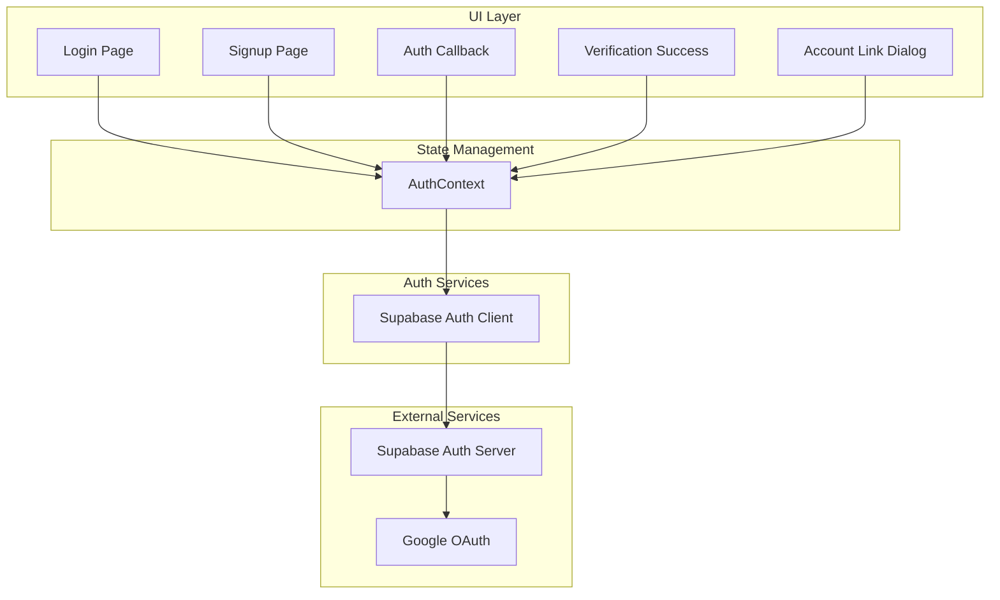

# Design Document: Auth Enhancements

## Overview

This design enhances the Lowkeygenius authentication system to provide a seamless email verification experience with automatic login, Google OAuth integration, and intelligent account linking. The implementation leverages Supabase Auth's built-in capabilities for OAuth and automatic identity linking while adding custom UI flows for user feedback and account merge notifications.

## Architecture

The authentication enhancements follow a layered architecture:



## Components and Interfaces

### 1. Enhanced AuthContext

Extend the existing `AuthContext` to support Google OAuth:

```typescript
interface AuthContextType {
  // Existing methods
  user: User | null;
  profile: Profile | null;
  session: Session | null;
  loading: boolean;
  isEmailVerified: boolean;
  signUp: (email: string, password: string, fullName?: string) => Promise<{ error: AuthError | null }>;
  signIn: (email: string, password: string) => Promise<{ error: AuthError | null }>;
  signOut: () => Promise<void>;
  refreshProfile: () => Promise<void>;
  resendVerificationEmail: () => Promise<{ error: AuthError | null }>;
  
  // New methods for Google OAuth
  signInWithGoogle: () => Promise<{ error: AuthError | null }>;
}
```

### 2. Google Sign-In Button Component

A reusable button component for Google authentication:

```typescript
interface GoogleSignInButtonProps {
  mode: 'signin' | 'signup';
  onError?: (error: AuthError) => void;
}
```

### 3. Account Link Dialog Component

A modal dialog for account linking notifications:

```typescript
interface AccountLinkDialogProps {
  isOpen: boolean;
  email: string;
  onConfirm: () => void;
  onCancel: () => void;
}
```

### 4. Enhanced Auth Callback Page

The callback page handles both email verification and OAuth callbacks:

```typescript
interface AuthCallbackState {
  loading: boolean;
  error: string | null;
  errorType: 'expired' | 'invalid' | 'network' | 'account_exists' | null;
  isNewRegistration: boolean;
  linkedAccount: boolean;
}
```

## Data Models

### Auth Event Types

```typescript
type AuthEventType = 
  | 'SIGNED_IN'
  | 'SIGNED_OUT'
  | 'USER_UPDATED'
  | 'PASSWORD_RECOVERY'
  | 'TOKEN_REFRESHED';

interface AuthStateChangePayload {
  event: AuthEventType;
  session: Session | null;
  isNewUser?: boolean;
  linkedIdentity?: boolean;
}
```

### User Identity

Supabase stores user identities in `auth.identities`:

```typescript
interface UserIdentity {
  id: string;
  user_id: string;
  identity_data: Record<string, unknown>;
  provider: 'email' | 'google';
  created_at: string;
  last_sign_in_at: string;
}
```

## Correctness Properties

*A property is a characteristic or behavior that should hold true across all valid executions of a system-essentially, a formal statement about what the system should do. Properties serve as the bridge between human-readable specifications and machine-verifiable correctness guarantees.*

Based on the prework analysis, the following correctness properties have been identified:

### Property 1: Session establishment after email verification
*For any* successful email verification callback, the system SHALL establish an authenticated session with a valid access token and refresh token.
**Validates: Requirements 1.2**

### Property 2: OAuth flow initiation with correct parameters
*For any* Google sign-in or sign-up button click, the system SHALL call `signInWithOAuth` with provider set to 'google' and redirectTo set to the configured callback URL.
**Validates: Requirements 2.1, 2.2**

### Property 3: Session establishment after OAuth completion
*For any* successful Google OAuth callback (whether new user or existing), the system SHALL establish an authenticated session.
**Validates: Requirements 2.4, 3.5**

## Error Handling

### OAuth Errors

| Error Type | User Message | Action |
|------------|--------------|--------|
| `access_denied` | "Google sign-in was cancelled" | Return to login page |
| `invalid_request` | "Invalid authentication request" | Show error, offer retry |
| `server_error` | "Authentication service unavailable" | Show error, offer retry |
| `network_error` | "Connection error. Please check your internet" | Show error, offer retry |

### Account Linking Scenarios

Supabase Auth handles automatic identity linking when:
1. A user signs in with Google using an email that matches an existing verified email account
2. The existing account's email is verified

The system will detect this scenario by checking if the OAuth callback includes an existing user with multiple identities and display an informational dialog.

## Testing Strategy

### Dual Testing Approach

The implementation uses both unit tests and property-based tests:

1. **Unit Tests**: Verify specific UI states, error messages, and component rendering
2. **Property-Based Tests**: Verify universal properties about authentication flows

### Property-Based Testing Framework

Use **fast-check** for property-based testing in TypeScript/React:

```typescript
import fc from 'fast-check';
```

Configuration:
- Minimum 100 iterations per property test
- Each test tagged with: `**Feature: auth-enhancements, Property {number}: {property_text}**`

### Test Categories

1. **AuthContext Tests**
   - `signInWithGoogle` initiates OAuth with correct parameters
   - Session state updates correctly after auth events
   - Error states are properly propagated

2. **Component Tests**
   - GoogleSignInButton renders correctly in both modes
   - AccountLinkDialog displays correct content
   - VerifyEmailSuccess shows success message and redirects

3. **Integration Tests**
   - OAuth callback handling
   - Email verification callback handling
   - Account linking flow

### Property Test Examples

```typescript
// Property 2: OAuth flow initiation
describe('OAuth Flow Initiation', () => {
  it('**Feature: auth-enhancements, Property 2: OAuth flow initiation with correct parameters**', async () => {
    await fc.assert(
      fc.asyncProperty(
        fc.constantFrom('signin', 'signup'),
        async (mode) => {
          const mockSignInWithOAuth = jest.fn().mockResolvedValue({ error: null });
          // ... test that signInWithOAuth is called with correct params
          expect(mockSignInWithOAuth).toHaveBeenCalledWith({
            provider: 'google',
            options: expect.objectContaining({
              redirectTo: expect.stringContaining('/auth/callback')
            })
          });
        }
      ),
      { numRuns: 100 }
    );
  });
});
```
