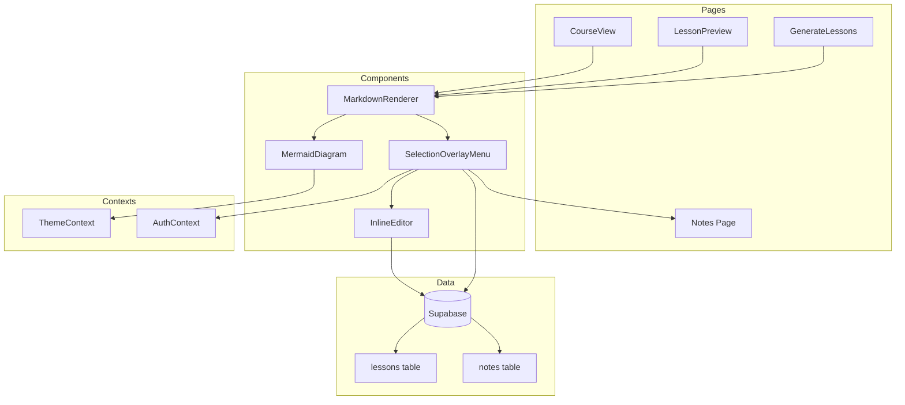

# Design Document: Course Content Enhancements

## Overview

This design document outlines the implementation of four key enhancements to the LearnSelf course viewing experience:

1. **Mermaid Diagram Rendering** - Integrate Mermaid.js to render flowcharts, sequence diagrams, and other visual representations within lesson markdown content
2. **Unified Markdown Renderer** - Create a single, reusable markdown rendering component used consistently across all course-related pages
3. **Inline Text Editing** - Enable course owners to edit lesson content directly by selecting text and using a contextual overlay menu
4. **Selection-Based Note Taking** - Allow learners to save selected text as notes with full context (course name, lesson title)

## Architecture

The enhancements follow a component-based architecture that integrates with the existing React application structure:



## Components and Interfaces

### 1. MarkdownRenderer Component

A unified component that handles all markdown rendering with Mermaid support.

```typescript
// src/components/MarkdownRenderer.tsx

interface MarkdownRendererProps {
  content: string;
  className?: string;
  enableSelection?: boolean;
  onTextSelect?: (selection: TextSelection) => void;
  courseId?: string;
  lessonId?: string;
  lessonTitle?: string;
  courseTitle?: string;
  isOwner?: boolean;
  onContentUpdate?: (newContent: string) => void;
}

interface TextSelection {
  text: string;
  startOffset: number;
  endOffset: number;
  rect: DOMRect;
}
```

### 2. MermaidDiagram Component

Renders Mermaid diagram code blocks as SVG visualizations.

```typescript
// src/components/MermaidDiagram.tsx

interface MermaidDiagramProps {
  code: string;
  className?: string;
}

interface MermaidError {
  message: string;
  originalCode: string;
}
```

### 3. SelectionOverlayMenu Component

A floating contextual menu that appears on text selection.

```typescript
// src/components/SelectionOverlayMenu.tsx

interface SelectionOverlayMenuProps {
  selection: TextSelection;
  position: { x: number; y: number };
  isOwner: boolean;
  onSaveNote: () => void;
  onEdit: () => void;
  onClose: () => void;
}
```

### 4. InlineEditor Component

Enables inline editing of selected text within the lesson content.

```typescript
// src/components/InlineEditor.tsx

interface InlineEditorProps {
  originalText: string;
  onSave: (newText: string) => Promise<void>;
  onCancel: () => void;
  position: { x: number; y: number };
}
```

### 5. Enhanced Notes Page

Updated to display notes with full context metadata.

```typescript
// src/pages/Notes.tsx (enhanced)

interface NoteWithContext {
  id: string;
  snippet_markdown: string;
  course_title: string;
  lesson_title: string;
  created_at: string;
}
```

## Data Models

### Notes Table Enhancement

The existing `notes` table already has the required structure. We'll add a join query to fetch course and lesson titles:

```sql
-- Query to fetch notes with context
SELECT 
  n.id,
  n.snippet_markdown,
  n.created_at,
  c.title as course_title,
  l.title as lesson_title
FROM notes n
JOIN courses c ON n.course_id = c.id
JOIN lessons l ON n.lesson_id = l.id
WHERE n.user_id = $1
ORDER BY n.created_at DESC;
```

No database schema changes are required as the existing `notes` table already stores `course_id` and `lesson_id` foreign keys.

## Correctness Properties

*A property is a characteristic or behavior that should hold true across all valid executions of a system-essentially, a formal statement about what the system should do. Properties serve as the bridge between human-readable specifications and machine-verifiable correctness guarantees.*

Based on the prework analysis, the following correctness properties have been identified:

### Property 1: Mermaid rendering produces SVG output
*For any* valid Mermaid diagram syntax, rendering the diagram SHALL produce an output containing an SVG element with the diagram visualization.
**Validates: Requirements 1.1**

### Property 2: Mermaid error handling preserves original code
*For any* invalid Mermaid diagram syntax, the renderer SHALL display both an error message and the original code block content.
**Validates: Requirements 1.2**

### Property 3: Mermaid theme reactivity
*For any* rendered Mermaid diagram, when the application theme changes, the diagram colors SHALL update to reflect the new theme values.
**Validates: Requirements 1.3, 1.4**

### Property 4: Markdown element rendering completeness
*For any* markdown content containing standard elements (headings, lists, code blocks, tables, blockquotes, links), the Markdown_Renderer SHALL produce HTML output containing the corresponding semantic elements.
**Validates: Requirements 2.2**

### Property 5: Selection menu displays role-appropriate options
*For any* text selection in lesson content, the Selection_Overlay_Menu SHALL display the "Save as Note" option for all users, and SHALL display the "Edit" option only when the current user is the Course_Owner.
**Validates: Requirements 3.1, 3.2, 3.4, 4.1**

### Property 6: Inline edit round-trip consistency
*For any* inline edit operation by a Course_Owner, saving the edit SHALL persist the new content to the database, and subsequently loading the lesson SHALL display the updated content.
**Validates: Requirements 3.3**

### Property 7: Note creation stores complete metadata
*For any* note created via text selection, the saved Note_Snippet SHALL contain the selected text, course_id, lesson_id, and user_id, and querying the note SHALL return the associated course_title and lesson_title.
**Validates: Requirements 4.2, 4.4**

### Property 8: Menu dismissal on external interaction
*For any* open Selection_Overlay_Menu, clicking outside the menu, deselecting text, or scrolling the page SHALL cause the menu to close.
**Validates: Requirements 5.2, 5.4**

### Property 9: Menu positioning within viewport bounds
*For any* text selection, the Selection_Overlay_Menu SHALL be positioned such that the entire menu remains within the visible viewport boundaries.
**Validates: Requirements 5.3**

## Error Handling

### Mermaid Rendering Errors
- Invalid syntax: Display error message with syntax hint and show original code in a code block
- Library load failure: Fall back to displaying raw code block with a warning message

### Inline Edit Errors
- Network failure: Show toast notification, preserve original content, allow retry
- Concurrent edit conflict: Show warning, offer to reload latest content

### Note Save Errors
- Network failure: Show toast notification with retry option
- Validation failure: Show specific error message (e.g., empty selection)

## Testing Strategy

### Unit Testing
Unit tests will verify individual component behavior:
- MermaidDiagram renders valid syntax correctly
- SelectionOverlayMenu shows correct options based on ownership
- InlineEditor saves and cancels correctly
- MarkdownRenderer handles all markdown element types

### Property-Based Testing
Property-based tests will use **fast-check** library to verify correctness properties:

1. **Mermaid rendering property**: Generate valid mermaid syntax strings, verify SVG output
2. **Mermaid error property**: Generate invalid strings, verify error display with original code
3. **Markdown rendering property**: Generate markdown with various elements, verify HTML output
4. **Selection menu property**: Generate user/owner combinations, verify menu options
5. **Edit round-trip property**: Generate edit operations, verify persistence and display
6. **Note metadata property**: Generate note saves, verify all metadata stored and retrievable
7. **Menu dismissal property**: Generate interaction events, verify menu closes
8. **Menu positioning property**: Generate selection positions, verify menu stays in viewport

Each property-based test will be configured to run a minimum of 100 iterations.

Test files will be annotated with the format: `**Feature: course-content-enhancements, Property {number}: {property_text}**`

### Integration Testing
- Full flow: Select text → Save note → View in Notes page with context
- Full flow: Select text → Edit → Save → Verify update in CourseView
- Theme switching with Mermaid diagrams rendered
