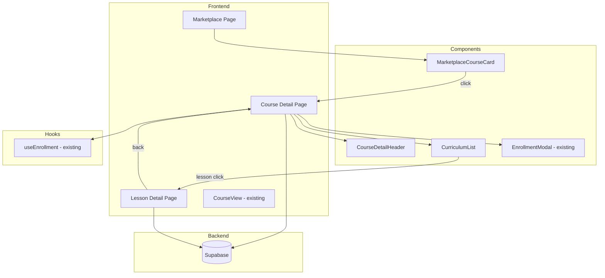
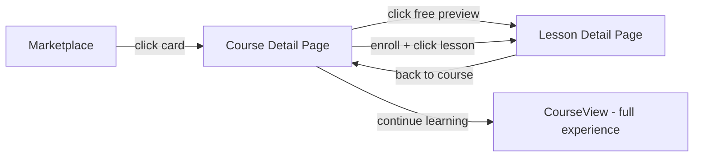

# Design Document: Course Detail Page

## Overview

This feature introduces a Course Detail Page that serves as an intermediate view between the Marketplace listing and lesson content. The page provides comprehensive course information, displays the full curriculum, handles enrollment, and controls access to lessons based on enrollment status. The first lesson is available as a free preview for authenticated users, while other lessons require enrollment.

## Architecture

The feature follows the existing React + Supabase architecture:



### Navigation Flow



## Components and Interfaces

### New Components

#### 1. CourseDetailPage (`src/pages/CourseDetailPage.tsx`)

Main page component for displaying course details.

```typescript
interface CourseDetailPageProps {
  // Route params
  courseId: string;
}

// Internal state
interface CourseDetailState {
  course: PublicCourseDetail | null;
  lessons: LessonSummary[];
  enrollmentStatus: EnrollmentStatus;
  loading: boolean;
  error: string | null;
}
```

#### 2. CurriculumList (`src/components/CurriculumList.tsx`)

Displays the course curriculum with modules and lessons.

```typescript
interface CurriculumListProps {
  modules: ModuleWithLessons[];
  isEnrolled: boolean;
  isOwner: boolean;
  onLessonClick: (lessonId: string, moduleIndex: number, lessonIndex: number) => void;
}

interface ModuleWithLessons {
  title: string;
  description: string;
  lessons: LessonSummary[];
}

interface LessonSummary {
  id: string;
  title: string;
  moduleIndex: number;
  lessonIndex: number;
  hasAudio: boolean;
}
```

#### 3. LessonDetailPage (`src/pages/LessonDetailPage.tsx`)

Standalone lesson view for marketplace courses.

```typescript
interface LessonDetailPageProps {
  // Route params
  courseId: string;
  lessonId: string;
}
```

### Modified Components

#### MarketplaceCourseCard

- Remove direct "Enroll" button
- Make entire card clickable
- Navigate to course detail page on click

### New Routes

| Route | Component | Description |
|-------|-----------|-------------|
| `/marketplace/:courseId` | CourseDetailPage | Course detail view |
| `/marketplace/:courseId/lesson/:lessonId` | LessonDetailPage | Lesson detail view |

## Data Models

### PublicCourseDetail

Extended course data for the detail page:

```typescript
interface PublicCourseDetail {
  id: string;
  title: string;
  description: string | null;
  topic: string;
  level: CourseLevel;
  estimated_duration_hours: number | null;
  creator_display_name: string | null;
  published_at: string | null;
  enrollment_count: number;
  owner_id: string;
  thumbnail_url: string | null;
  outline_json: CourseOutlineJson | null;
}

interface CourseOutlineJson {
  modules: Array<{
    title: string;
    description: string;
    lessons: Array<{ title: string; objectives: string[] }>;
  }>;
}
```

### LessonDetail

Lesson data for the lesson detail page:

```typescript
interface LessonDetail {
  id: string;
  title: string;
  objectives: string[] | null;
  markdown_content: string | null;
  module_index: number;
  lesson_index: number;
  audio_url: string | null;
  course_id: string;
}
```

## Correctness Properties

*A property is a characteristic or behavior that should hold true across all valid executions of a system-essentially, a formal statement about what the system should do. Properties serve as the bridge between human-readable specifications and machine-verifiable correctness guarantees.*

Based on the prework analysis, the following properties can be verified through property-based testing:

### Property 1: Course detail displays all required fields
*For any* valid course with title, description, level, topic, duration, and creator, rendering the course detail page should produce output containing all of these fields.
**Validates: Requirements 1.1**

### Property 2: Curriculum displays all modules and lessons
*For any* course with an outline containing modules and lessons, rendering the curriculum list should produce output containing all module titles and all lesson titles.
**Validates: Requirements 1.2**

### Property 3: Thumbnail conditional rendering
*For any* course, if the course has a thumbnail_url, the rendered output should contain an image element with that URL; if no thumbnail_url exists, a placeholder should be displayed.
**Validates: Requirements 1.3**

### Property 4: First lesson marked as free preview
*For any* curriculum with at least one lesson, the first lesson (module_index=0, lesson_index=0) should be marked with a "Free Preview" indicator.
**Validates: Requirements 2.1**

### Property 5: Non-enrolled users cannot access non-preview lessons
*For any* non-enrolled user clicking on a lesson that is not the first lesson, the system should display an enrollment required message instead of navigating.
**Validates: Requirements 2.3**

### Property 6: Enrolled users can access all lessons
*For any* enrolled user or course owner, clicking on any lesson in the curriculum should trigger navigation to that lesson's detail page.
**Validates: Requirements 2.4**

### Property 7: Lesson detail displays required content
*For any* lesson with title, objectives, and markdown content, rendering the lesson detail page should produce output containing all of these elements.
**Validates: Requirements 6.1**

### Property 8: Audio option conditional rendering
*For any* lesson, if the lesson has an audio_url, the rendered output should contain an audio playback option; if no audio_url exists, no audio option should be displayed.
**Validates: Requirements 6.2**

## Error Handling

### Course Not Found
- Display a friendly error message with navigation back to marketplace
- Log error for debugging

### Lesson Not Found
- Display error message indicating lesson doesn't exist
- Provide navigation back to course detail page

### Enrollment Errors
- Handled by existing EnrollmentModal component
- Display appropriate error messages for limit reached, already enrolled, etc.

### Network Errors
- Show loading states during data fetching
- Display retry option on network failures

## Testing Strategy

### Property-Based Testing

Use **fast-check** library for property-based testing in TypeScript/React.

Properties to test:
1. Course detail field rendering (Property 1)
2. Curriculum completeness (Property 2)
3. Thumbnail conditional rendering (Property 3)
4. Free preview marking (Property 4)
5. Access control for non-enrolled users (Property 5)
6. Access for enrolled users (Property 6)
7. Lesson detail field rendering (Property 7)
8. Audio option conditional rendering (Property 8)

Each property test should run a minimum of 100 iterations.

### Unit Testing

Unit tests will cover:
- Component rendering with various props
- Navigation behavior
- Button state based on enrollment status
- Error state handling

### Integration Testing

- Full flow from marketplace to course detail to lesson detail
- Enrollment flow integration
- Navigation context preservation
