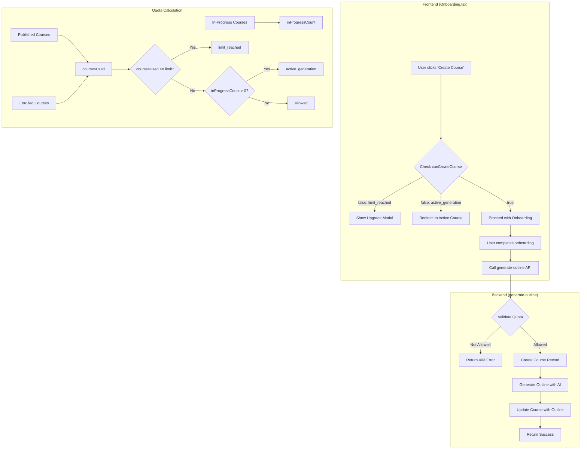

# Design Document: Course Generation Quota Fix

## Overview

This design addresses a critical bug in the course generation flow where quota validation occurs after course creation, leading to orphaned draft courses and incorrect quota calculations. The solution restructures the flow to validate quotas before any database operations and introduces a clear "active generation slot" concept that allows users to work on one course at a time without consuming their quota until publication.

## Architecture

The quota enforcement system follows a two-phase validation approach:



## Components and Interfaces

### 1. Updated Quota Validation Logic

The core change is in how we calculate and enforce quotas:

**Current (Buggy) Logic:**
```typescript
const currentCount = publishedCount + enrolledCount;
const totalActive = currentCount + inProgressCount;
const activeBlock = !limitReached && totalActive > limit;
```

**New Logic:**
```typescript
const coursesUsed = publishedCount + enrolledCount;  // Only published + enrolled count
const limitReached = coursesUsed >= limit;
const hasActiveGeneration = inProgressCount > 0;
const activeBlock = !limitReached && hasActiveGeneration;  // Block if ANY in-progress exists
```

### 2. Backend Quota Validation (quota-validation.ts)

**Updated Interface:**
```typescript
interface QuotaValidationResult {
  allowed: boolean;
  coursesUsed: number;        // Published + enrolled (what counts against limit)
  limit: number;
  planType: PlanType;
  inProgressCount: number;    // Courses in generation (don't count against limit)
  activeGenerationId?: string; // ID of the in-progress course if blocking
  reason?: 'limit_reached' | 'active_generation';
  error?: string;
}
```

### 3. Frontend useSubscription Hook

The hook already provides the necessary data. The key fields:
- `coursesUsed`: Published + enrolled courses (counts against limit)
- `inProgressCount`: Courses in generation (doesn't count against limit)
- `activeGenerationCourse`: Details of the in-progress course for navigation
- `blockingReason`: 'limit_reached' | 'active_generation'

### 4. Updated Onboarding Flow

The Onboarding page already checks `canCreateCourse` on mount. The fix ensures:
1. Quota is validated BEFORE course creation
2. Course creation happens in the backend after validation passes
3. If generation fails, the course record is cleaned up or left for retry

### 5. Course Creation in Backend

Move course creation from frontend to backend to ensure atomicity:

**Current Flow (Frontend creates course):**
1. Frontend creates course with status 'draft_outline'
2. Frontend calls generate-outline API
3. Backend validates quota (too late!)
4. Backend generates outline

**New Flow (Backend creates course):**
1. Frontend calls generate-outline API with course data
2. Backend validates quota
3. Backend creates course record
4. Backend generates outline
5. Backend updates course with outline

## Data Models

No new data models required. The existing models support the fix:

- `courses.status`: 'draft_outline' | 'generating_lessons' | 'ready' | 'published'
- `course_enrollments`: Tracks marketplace enrollments
- `profiles.plan_type`: User's subscription plan

### Quota Calculation Logic

```typescript
// Published courses (count against limit)
const publishedCount = courses.filter(c => c.status === 'published').length;

// Enrolled courses (count against limit)  
const enrolledCount = enrollments.length;

// In-progress courses (DON'T count against limit, but block new generation)
const inProgressCount = courses.filter(c => c.status !== 'published').length;

// What counts against the plan limit
const coursesUsed = publishedCount + enrolledCount;

// Can create new course?
const limitReached = coursesUsed >= planLimit;
const hasActiveGeneration = inProgressCount > 0;
const canCreateCourse = !limitReached && !hasActiveGeneration;
```

## Correctness Properties

*A property is a characteristic or behavior that should hold true across all valid executions of a system-essentially, a formal statement about what the system should do. Properties serve as the bridge between human-readable specifications and machine-verifiable correctness guarantees.*

### Property 1: Quota counts only published and enrolled courses
*For any* user with any combination of courses (draft_outline, generating_lessons, ready, published) and enrollments, the `coursesUsed` value should equal exactly the count of published courses plus the count of enrolled courses, excluding all in-progress courses.
**Validates: Requirements 1.1, 1.2**

### Property 2: Active generation blocks new course creation
*For any* non-PRO_MAX user with `coursesUsed < limit` and `inProgressCount > 0`, the `canCreateCourse` should be false with `blockingReason = 'active_generation'`.
**Validates: Requirements 1.3, 3.1**

### Property 3: Failed quota validation creates no records
*For any* user whose quota validation fails (either limit_reached or active_generation), calling the generate-outline API should return a 403 error and the total course count in the database should remain unchanged.
**Validates: Requirements 2.1, 2.2**

### Property 4: Successful quota validation creates course
*For any* user whose quota validation succeeds, calling the generate-outline API should create exactly one new course record in the database.
**Validates: Requirements 2.3**

### Property 5: Active generation provides course details
*For any* user blocked by active_generation, the `activeGenerationCourse` object should contain the id, status, and title of the in-progress course.
**Validates: Requirements 3.2**

### Property 6: Limit reached shows correct usage
*For any* user with `coursesUsed >= limit`, the `blockingReason` should be 'limit_reached' and `coursesUsed` should accurately reflect their published + enrolled count.
**Validates: Requirements 3.3**

### Property 7: Deletion frees generation slot
*For any* user with an in-progress course, after deleting that course, `canCreateCourse` should become true (assuming `coursesUsed < limit`).
**Validates: Requirements 4.3**

### Property 8: PRO_MAX unlimited access
*For any* PRO_MAX user, regardless of their `coursesUsed` or `inProgressCount`, `canCreateCourse` should always be true.
**Validates: Requirements 5.1, 5.2**

## Error Handling

### Frontend Errors
- **limit_reached**: Show upgrade modal with current usage (coursesUsed/limit)
- **active_generation**: Show message with link to continue existing course
- **Loading state**: Disable buttons while quota is being checked
- **Network error**: Show retry option, default to blocking creation

### Backend Errors
- **limit_reached**: Return 403 with `{ error: "Course limit reached...", reason: "limit_reached", coursesUsed, limit }`
- **active_generation**: Return 403 with `{ error: "Finish your existing course...", reason: "active_generation", activeGenerationId }`
- **Database error**: Return 500 with generic error, log details
- **Invalid token**: Return 401 with authentication error

## Testing Strategy

### Unit Tests
- Test quota calculation logic for each plan type
- Test blocking logic for active generation
- Test PRO_MAX bypass logic
- Test course deletion and slot freeing

### Property-Based Tests
The property-based testing library to use is **fast-check** for TypeScript.

Each property-based test should:
- Run a minimum of 100 iterations
- Be tagged with the correctness property it implements using format: `**Feature: course-generation-quota-fix, Property {number}: {property_text}**`
- Generate random but valid user states and course configurations

**Property Test Coverage:**
1. Property 1: Generate random users with various course states, verify coursesUsed calculation
2. Property 2: Generate users with in-progress courses below limit, verify blocking
3. Property 3: Generate over-quota requests, verify no records created
4. Property 4: Generate valid requests, verify course creation
5. Property 5: Generate users with active generation, verify course details populated
6. Property 6: Generate users at/over limit, verify blockingReason
7. Property 7: Generate users with in-progress courses, simulate deletion, verify slot freed
8. Property 8: Generate PRO_MAX users with any state, verify always allowed

### Integration Tests
- Test full flow from onboarding to course creation
- Test redirect behavior when blocked by active generation
- Test course deletion and subsequent creation

