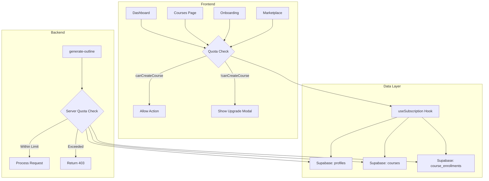

# Design Document: Course Quota Enforcement

## Overview

This design addresses the inconsistent enforcement of course generation quotas in the Lowkeygenius platform. The solution implements a dual-layer enforcement strategy: frontend UI prevention and backend server-side validation. This ensures users cannot bypass their plan limits regardless of how they attempt to create courses.

## Architecture

The quota enforcement system follows a layered architecture:



## Components and Interfaces

### 1. useSubscription Hook (Enhanced)

The existing `useSubscription` hook already provides `canCreateCourse`. No changes needed to the hook itself.

**Interface:**
```typescript
interface SubscriptionData {
  planType: PlanType;
  coursesUsed: number;
  coursesCreated: number;
  coursesEnrolled: number;
  coursesLimit: number;
  canCreateCourse: boolean;
  isAudioEnabled: boolean;
  subscriptionStatus: string | null;
  subscriptionEndsAt: Date | null;
  subscriptionPeriodStart: Date | null;
  billingCycle: string | null;
  isLoading: boolean;
}
```

### 2. QuotaGuard Component (New)

A reusable component that wraps course creation actions and handles quota enforcement.

**Interface:**
```typescript
interface QuotaGuardProps {
  children: React.ReactNode;
  onQuotaExceeded?: () => void;
  showModalOnExceeded?: boolean;
}
```

### 3. Backend Quota Validation (New)

A utility function for edge functions to validate quota before processing.

**Interface:**
```typescript
interface QuotaValidationResult {
  allowed: boolean;
  currentCount: number;
  limit: number;
  planType: string;
  error?: string;
}

async function validateUserQuota(
  supabase: SupabaseClient,
  userId: string
): Promise<QuotaValidationResult>
```

### 4. Updated Page Components

#### Dashboard.tsx Changes
- Add quota check to "Create Your First Course" button in empty state
- Ensure upgrade modal is shown when quota exceeded

#### Courses.tsx Changes
- Add quota check to "New Course" button
- Show upgrade modal when quota exceeded

#### Onboarding.tsx Changes
- Add quota check on component mount
- Redirect to dashboard if quota exceeded
- Show toast notification explaining the redirect

## Data Models

No new data models required. The existing models support quota enforcement:

- `profiles.plan_type` - User's subscription plan
- `profiles.subscription_period_start` - Start of billing cycle for paid plans
- `courses` - Tracks courses created by user
- `course_enrollments` - Tracks marketplace enrollments

### Quota Calculation Logic

```typescript
// For FREE users: count ALL courses (lifetime limit)
// For PLUS/PRO users: count courses since subscription_period_start
// For PRO_MAX users: unlimited (skip check)

const coursesUsed = coursesCreated + coursesEnrolled;
const canCreateCourse = planType === 'PRO_MAX' || coursesUsed < planLimit;
```

## Correctness Properties

*A property is a characteristic or behavior that should hold true across all valid executions of a system-essentially, a formal statement about what the system should do. Properties serve as the bridge between human-readable specifications and machine-verifiable correctness guarantees.*

### Property 1: Quota-limited users see blocking UI
*For any* user whose coursesUsed >= coursesLimit (and planType !== 'PRO_MAX'), attempting to create a course through any UI entry point (Dashboard, Courses page, Onboarding) should result in either a disabled button, an upgrade modal, or a redirect - never navigation to course creation.
**Validates: Requirements 1.1, 1.2, 1.3, 3.2**

### Property 2: Backend rejects over-quota requests
*For any* authenticated request to generate-outline where the user's course count >= plan limit (and planType !== 'PRO_MAX'), the response should be HTTP 403 with error message containing "Course limit reached".
**Validates: Requirements 2.1, 2.2**

### Property 3: Billing cycle course counting
*For any* user with a billing cycle plan (PLUS, PRO), the coursesUsed count should only include courses where created_at >= subscription_period_start.
**Validates: Requirements 2.3**

### Property 4: FREE plan lifetime counting
*For any* FREE plan user, the coursesUsed count should include all courses regardless of creation date.
**Validates: Requirements 2.4**

### Property 5: PRO_MAX unlimited access
*For any* PRO_MAX user, canCreateCourse should always be true and quota checks should be bypassed in both frontend and backend.
**Validates: Requirements 4.1, 4.2**

### Property 6: Enrollment affects quota
*For any* user, after enrolling in a marketplace course, their coursesUsed count should increase by exactly 1, and this should affect their ability to create new courses.
**Validates: Requirements 5.1, 5.2, 5.3**

## Error Handling

### Frontend Errors
- **Quota exceeded**: Show upgrade modal with current usage and plan info
- **Loading state**: Disable buttons while quota is being checked
- **Network error**: Show retry option, default to blocking creation

### Backend Errors
- **Quota exceeded**: Return 403 with clear error message
- **Database error**: Return 500 with generic error, log details
- **Invalid token**: Return 401 with authentication error

## Testing Strategy

### Unit Tests
- Test quota calculation logic for each plan type
- Test billing cycle date filtering
- Test PRO_MAX bypass logic

### Property-Based Tests
The property-based testing library to use is **fast-check** for TypeScript.

Each property-based test should:
- Run a minimum of 100 iterations
- Be tagged with the correctness property it implements
- Generate random but valid user states and plan configurations

**Property Test Coverage:**
1. Property 1: Generate random users at/over quota, verify UI blocking
2. Property 2: Generate random over-quota requests, verify 403 response
3. Property 3: Generate random billing cycle users with courses at various dates, verify counting
4. Property 4: Generate random FREE users with courses at various dates, verify all counted
5. Property 5: Generate random PRO_MAX users, verify always allowed
6. Property 6: Generate random enrollments, verify count increases

### Integration Tests
- Test full flow from UI click to backend validation
- Test redirect behavior on Onboarding page
- Test modal display and upgrade navigation
