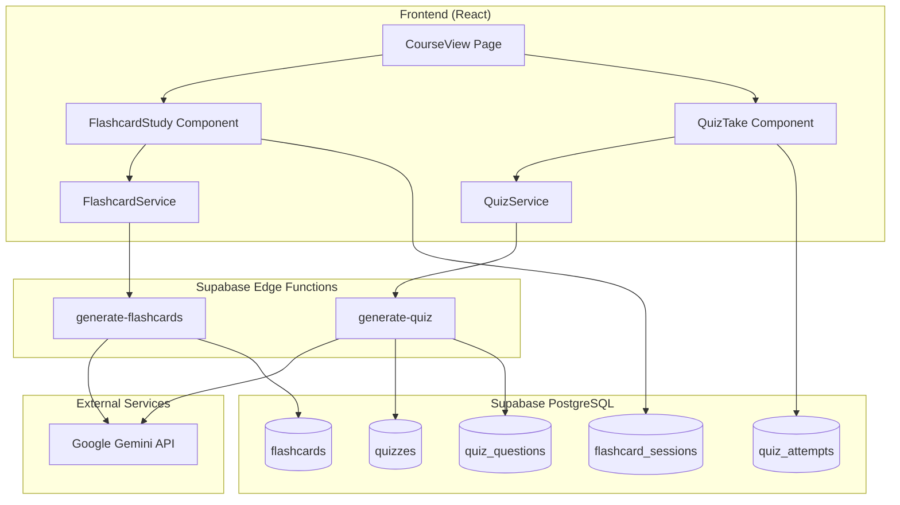

# Design Document: Flashcard and Quiz Generation

## Overview

This design document describes the architecture and implementation of an optional flashcard and quiz generation feature for LearnSelf. The feature leverages Google Gemini AI to generate educational flashcards and quizzes from lesson content, providing users with interactive study tools to reinforce their learning.

The feature is designed to be:
- **Optional**: Users can generate flashcards/quizzes at any time, not required for course completion
- **On-demand**: Content is generated when requested, not automatically
- **Persistent**: Generated content is stored and reused across sessions
- **Trackable**: User progress and quiz attempts are recorded for learning analytics

## Architecture



## Components and Interfaces

### Frontend Components

#### FlashcardButton Component
Renders a button to generate or view flashcards for a lesson.

```typescript
interface FlashcardButtonProps {
  lessonId: string;
  lessonTitle: string;
  hasFlashcards: boolean;
  onGenerate: () => void;
  onView: () => void;
}
```

#### FlashcardStudy Component
Full-screen study interface for flashcards with flip interaction.

```typescript
interface FlashcardStudyProps {
  lessonId: string;
  flashcards: Flashcard[];
  onComplete: (results: StudySessionResult) => void;
  onClose: () => void;
}

interface StudySessionResult {
  totalCards: number;
  masteredCards: number;
  reviewCards: number;
  responses: FlashcardResponse[];
}

interface FlashcardResponse {
  flashcardId: string;
  response: 'got_it' | 'need_review';
  timeSpentMs: number;
}
```

#### QuizButton Component
Renders a button to generate or take a quiz for a lesson.

```typescript
interface QuizButtonProps {
  lessonId: string;
  lessonTitle: string;
  hasQuiz: boolean;
  onGenerate: () => void;
  onTake: () => void;
}
```

#### QuizTake Component
Full-screen quiz interface with immediate feedback.

```typescript
interface QuizTakeProps {
  lessonId: string;
  quiz: Quiz;
  questions: QuizQuestion[];
  onComplete: (attempt: QuizAttemptResult) => void;
  onClose: () => void;
}

interface QuizAttemptResult {
  quizId: string;
  answers: QuizAnswer[];
  score: number;
  totalQuestions: number;
  percentage: number;
}

interface QuizAnswer {
  questionId: string;
  selectedIndex: number;
  isCorrect: boolean;
}
```

#### QuizHistory Component
Displays previous quiz attempts with scores and trends.

```typescript
interface QuizHistoryProps {
  lessonId: string;
  attempts: QuizAttempt[];
}
```

### Service Layer

#### FlashcardService
Handles flashcard generation, retrieval, and session management.

```typescript
interface FlashcardService {
  generateFlashcards(lessonId: string, lessonContent: string, courseLevel: string): Promise<Flashcard[]>;
  getFlashcards(lessonId: string): Promise<Flashcard[] | null>;
  regenerateFlashcards(lessonId: string, lessonContent: string, courseLevel: string): Promise<Flashcard[]>;
  saveStudySession(lessonId: string, userId: string, results: StudySessionResult): Promise<void>;
  getStudySessions(lessonId: string, userId: string): Promise<FlashcardSession[]>;
}
```

#### QuizService
Handles quiz generation, retrieval, and attempt management.

```typescript
interface QuizService {
  generateQuiz(lessonId: string, lessonContent: string, courseLevel: string): Promise<{ quiz: Quiz; questions: QuizQuestion[] }>;
  getQuiz(lessonId: string): Promise<{ quiz: Quiz; questions: QuizQuestion[] } | null>;
  regenerateQuiz(lessonId: string, lessonContent: string, courseLevel: string): Promise<{ quiz: Quiz; questions: QuizQuestion[] }>;
  saveQuizAttempt(quizId: string, userId: string, result: QuizAttemptResult): Promise<QuizAttempt>;
  getQuizAttempts(quizId: string, userId: string): Promise<QuizAttempt[]>;
}
```

### Edge Functions

#### generate-flashcards
Generates flashcards using Gemini AI.

```typescript
interface GenerateFlashcardsRequest {
  lessonId: string;
  lessonContent: string;
  lessonTitle: string;
  courseLevel: 'beginner' | 'intermediate' | 'advanced' | 'expert';
}

interface GenerateFlashcardsResponse {
  flashcards: Array<{
    front: string;
    back: string;
  }>;
}
```

#### generate-quiz
Generates quiz questions using Gemini AI.

```typescript
interface GenerateQuizRequest {
  lessonId: string;
  lessonContent: string;
  lessonTitle: string;
  courseLevel: 'beginner' | 'intermediate' | 'advanced' | 'expert';
}

interface GenerateQuizResponse {
  questions: Array<{
    questionText: string;
    questionType: 'multiple_choice' | 'true_false';
    options: string[];
    correctIndex: number;
    explanation: string;
  }>;
}
```

## Data Models

### Flashcard

```typescript
interface Flashcard {
  id: string;
  lesson_id: string;
  front_text: string;
  back_text: string;
  order_index: number;
  created_at: string;
  updated_at: string;
}
```

### FlashcardSession

```typescript
interface FlashcardSession {
  id: string;
  user_id: string;
  lesson_id: string;
  total_cards: number;
  mastered_cards: number;
  review_cards: number;
  responses_json: FlashcardResponse[];
  completed_at: string;
  created_at: string;
}
```

### Quiz

```typescript
interface Quiz {
  id: string;
  lesson_id: string;
  title: string;
  question_count: number;
  created_at: string;
  updated_at: string;
}
```

### QuizQuestion

```typescript
type QuestionType = 'multiple_choice' | 'true_false';

interface QuizQuestion {
  id: string;
  quiz_id: string;
  question_text: string;
  question_type: QuestionType;
  options: string[];
  correct_index: number;
  explanation: string;
  order_index: number;
  created_at: string;
}
```

### QuizAttempt

```typescript
interface QuizAttempt {
  id: string;
  quiz_id: string;
  user_id: string;
  score: number;
  total_questions: number;
  percentage: number;
  answers_json: QuizAnswer[];
  completed_at: string;
  created_at: string;
}
```

## Database Schema

```sql
-- Flashcards table
CREATE TABLE flashcards (
  id UUID PRIMARY KEY DEFAULT gen_random_uuid(),
  lesson_id UUID NOT NULL REFERENCES lessons(id) ON DELETE CASCADE,
  front_text TEXT NOT NULL,
  back_text TEXT NOT NULL,
  order_index INTEGER NOT NULL DEFAULT 0,
  created_at TIMESTAMPTZ NOT NULL DEFAULT NOW(),
  updated_at TIMESTAMPTZ NOT NULL DEFAULT NOW()
);

CREATE INDEX idx_flashcards_lesson_id ON flashcards(lesson_id);

-- Flashcard sessions table
CREATE TABLE flashcard_sessions (
  id UUID PRIMARY KEY DEFAULT gen_random_uuid(),
  user_id UUID NOT NULL REFERENCES auth.users(id) ON DELETE CASCADE,
  lesson_id UUID NOT NULL REFERENCES lessons(id) ON DELETE CASCADE,
  total_cards INTEGER NOT NULL,
  mastered_cards INTEGER NOT NULL,
  review_cards INTEGER NOT NULL,
  responses_json JSONB NOT NULL DEFAULT '[]',
  completed_at TIMESTAMPTZ NOT NULL DEFAULT NOW(),
  created_at TIMESTAMPTZ NOT NULL DEFAULT NOW()
);

CREATE INDEX idx_flashcard_sessions_user_lesson ON flashcard_sessions(user_id, lesson_id);

-- Quizzes table
CREATE TABLE quizzes (
  id UUID PRIMARY KEY DEFAULT gen_random_uuid(),
  lesson_id UUID NOT NULL REFERENCES lessons(id) ON DELETE CASCADE,
  title TEXT NOT NULL,
  question_count INTEGER NOT NULL DEFAULT 0,
  created_at TIMESTAMPTZ NOT NULL DEFAULT NOW(),
  updated_at TIMESTAMPTZ NOT NULL DEFAULT NOW(),
  UNIQUE(lesson_id)
);

CREATE INDEX idx_quizzes_lesson_id ON quizzes(lesson_id);

-- Quiz questions table
CREATE TABLE quiz_questions (
  id UUID PRIMARY KEY DEFAULT gen_random_uuid(),
  quiz_id UUID NOT NULL REFERENCES quizzes(id) ON DELETE CASCADE,
  question_text TEXT NOT NULL,
  question_type TEXT NOT NULL CHECK (question_type IN ('multiple_choice', 'true_false')),
  options JSONB NOT NULL,
  correct_index INTEGER NOT NULL,
  explanation TEXT NOT NULL,
  order_index INTEGER NOT NULL DEFAULT 0,
  created_at TIMESTAMPTZ NOT NULL DEFAULT NOW()
);

CREATE INDEX idx_quiz_questions_quiz_id ON quiz_questions(quiz_id);

-- Quiz attempts table
CREATE TABLE quiz_attempts (
  id UUID PRIMARY KEY DEFAULT gen_random_uuid(),
  quiz_id UUID NOT NULL REFERENCES quizzes(id) ON DELETE CASCADE,
  user_id UUID NOT NULL REFERENCES auth.users(id) ON DELETE CASCADE,
  score INTEGER NOT NULL,
  total_questions INTEGER NOT NULL,
  percentage DECIMAL(5,2) NOT NULL,
  answers_json JSONB NOT NULL,
  completed_at TIMESTAMPTZ NOT NULL DEFAULT NOW(),
  created_at TIMESTAMPTZ NOT NULL DEFAULT NOW()
);

CREATE INDEX idx_quiz_attempts_user_quiz ON quiz_attempts(user_id, quiz_id);

-- RLS Policies
ALTER TABLE flashcards ENABLE ROW LEVEL SECURITY;
ALTER TABLE flashcard_sessions ENABLE ROW LEVEL SECURITY;
ALTER TABLE quizzes ENABLE ROW LEVEL SECURITY;
ALTER TABLE quiz_questions ENABLE ROW LEVEL SECURITY;
ALTER TABLE quiz_attempts ENABLE ROW LEVEL SECURITY;

-- Flashcards: readable by anyone who can access the lesson
CREATE POLICY "Flashcards are viewable by authenticated users"
  ON flashcards FOR SELECT
  TO authenticated
  USING (true);

-- Flashcard sessions: users can only see their own
CREATE POLICY "Users can view their own flashcard sessions"
  ON flashcard_sessions FOR SELECT
  TO authenticated
  USING (auth.uid() = user_id);

CREATE POLICY "Users can insert their own flashcard sessions"
  ON flashcard_sessions FOR INSERT
  TO authenticated
  WITH CHECK (auth.uid() = user_id);

-- Quizzes: readable by anyone who can access the lesson
CREATE POLICY "Quizzes are viewable by authenticated users"
  ON quizzes FOR SELECT
  TO authenticated
  USING (true);

-- Quiz questions: readable by anyone who can access the quiz
CREATE POLICY "Quiz questions are viewable by authenticated users"
  ON quiz_questions FOR SELECT
  TO authenticated
  USING (true);

-- Quiz attempts: users can only see their own
CREATE POLICY "Users can view their own quiz attempts"
  ON quiz_attempts FOR SELECT
  TO authenticated
  USING (auth.uid() = user_id);

CREATE POLICY "Users can insert their own quiz attempts"
  ON quiz_attempts FOR INSERT
  TO authenticated
  WITH CHECK (auth.uid() = user_id);
```

## Correctness Properties

*A property is a characteristic or behavior that should hold true across all valid executions of a system-essentially, a formal statement about what the system should do. Properties serve as the bridge between human-readable specifications and machine-verifiable correctness guarantees.*

Based on the prework analysis, the following correctness properties have been identified:

### Property 1: Flashcard caching consistency
*For any* lesson with existing flashcards, calling `getFlashcards` SHALL return the stored flashcards without invoking the generation service.
**Validates: Requirements 1.5**

### Property 2: Quiz caching consistency
*For any* lesson with an existing quiz, calling `getQuiz` SHALL return the stored quiz without invoking the generation service.
**Validates: Requirements 3.5**

### Property 3: Flashcard flip state toggle
*For any* flashcard in a study session, clicking the card SHALL toggle its display state between front and back.
**Validates: Requirements 2.2**

### Property 4: Study session response tracking
*For any* flashcard response ("got_it" or "need_review"), the session state SHALL record the response and the summary SHALL correctly count mastered versus review cards.
**Validates: Requirements 2.3, 2.4**

### Property 5: Review card prioritization
*For any* study session restart, cards previously marked as "need_review" SHALL appear before cards marked as "got_it" in the card order.
**Validates: Requirements 2.5**

### Property 6: Answer correctness determination
*For any* quiz answer submission, the system SHALL correctly determine if the selected index matches the correct_index for that question.
**Validates: Requirements 4.3**

### Property 7: Quiz score calculation
*For any* completed quiz attempt, the score SHALL equal the count of correct answers, and the percentage SHALL equal (score / total_questions) * 100.
**Validates: Requirements 4.5**

### Property 8: Flashcard regeneration replacement
*For any* flashcard regeneration, the new flashcards SHALL replace all existing flashcards for that lesson while flashcard_sessions records remain unchanged.
**Validates: Requirements 5.1, 5.4**

### Property 9: Quiz regeneration replacement
*For any* quiz regeneration, the new quiz SHALL replace the existing quiz for that lesson while quiz_attempts records remain unchanged.
**Validates: Requirements 5.2, 5.4**

### Property 10: Quiz attempt persistence
*For any* completed quiz, a new quiz_attempt record SHALL be created with all required fields, and retaking SHALL create additional records without modifying existing ones.
**Validates: Requirements 6.1, 6.4**

### Property 11: Quiz history retrieval
*For any* user and quiz, `getQuizAttempts` SHALL return all stored attempts for that user-quiz combination ordered by completion date.
**Validates: Requirements 6.2**

### Property 12: Flashcard count bounds
*For any* generated flashcard set, the count SHALL be between 5 and 15 inclusive.
**Validates: Requirements 7.1**

### Property 13: Quiz question count bounds
*For any* generated quiz, the question count SHALL be between 5 and 10 inclusive.
**Validates: Requirements 7.3**

### Property 14: Quiz question type diversity
*For any* generated quiz with more than 2 questions, the quiz SHALL contain at least one multiple_choice and at least one true_false question.
**Validates: Requirements 7.4**

### Property 15: Quiz question structure validity
*For any* quiz question, the correct_index SHALL be a valid index within the options array (0 <= correct_index < options.length).
**Validates: Requirements 7.5**

### Property 16: Flashcard data structure completeness
*For any* stored flashcard, the record SHALL contain non-empty front_text, non-empty back_text, valid lesson_id reference, and valid created_at timestamp.
**Validates: Requirements 8.1**

### Property 17: Quiz question data structure completeness
*For any* stored quiz question, the record SHALL contain non-empty question_text, valid question_type, non-empty options array, valid correct_index, non-empty explanation, and valid quiz_id reference.
**Validates: Requirements 8.2**

### Property 18: Quiz attempt data structure completeness
*For any* stored quiz attempt, the record SHALL contain valid user_id, valid quiz_id, answers_json array, score, total_questions, percentage, and completed_at timestamp.
**Validates: Requirements 8.3**

### Property 19: Flashcard serialization round-trip
*For any* valid Flashcard object, serializing to JSON and deserializing SHALL produce an equivalent object.
**Validates: Requirements 8.4, 8.6**

### Property 20: Quiz serialization round-trip
*For any* valid Quiz and QuizQuestion objects, serializing to JSON and deserializing SHALL produce equivalent objects.
**Validates: Requirements 8.5, 8.6**

## Error Handling

### Generation Errors
- **Rate Limiting**: If Gemini API returns 429, display "Rate limit exceeded. Please wait a moment and try again." with exponential backoff retry
- **API Errors**: Display user-friendly error message with retry button
- **Network Errors**: Display "Network error. Please check your connection and try again."
- **Invalid Response**: If AI returns malformed data, log error and display "Failed to generate content. Please try again."

### Storage Errors
- **Database Errors**: Log error, display "Failed to save. Please try again."
- **Constraint Violations**: Handle gracefully with appropriate user feedback

### Client-Side Errors
- **Missing Content**: If lesson has no markdown_content, disable generation buttons with tooltip "Lesson content required"
- **Session Timeout**: Prompt user to re-authenticate

## Testing Strategy

### Dual Testing Approach

This feature requires both unit tests and property-based tests:

**Unit Tests** verify specific examples and edge cases:
- Component rendering with various props
- Error state handling
- Loading state transitions
- Edge cases like empty flashcard sets

**Property-Based Tests** verify universal properties across all inputs:
- Data structure validity
- Serialization round-trips
- Score calculations
- Count bounds

### Property-Based Testing Framework

Use **fast-check** for TypeScript property-based testing.

```bash
npm install --save-dev fast-check
```

### Test Configuration

- Minimum 100 iterations per property test
- Each property test must be tagged with: `**Feature: flashcard-quiz-generation, Property {number}: {property_text}**`

### Test Categories

1. **Flashcard Service Tests**
   - Generation returns valid flashcard structure
   - Caching returns existing flashcards
   - Regeneration replaces flashcards

2. **Quiz Service Tests**
   - Generation returns valid quiz structure
   - Score calculation accuracy
   - Attempt persistence

3. **Component Tests**
   - FlashcardStudy flip interaction
   - QuizTake answer selection and feedback
   - Loading and error states

4. **Integration Tests**
   - End-to-end generation flow
   - Database persistence verification
