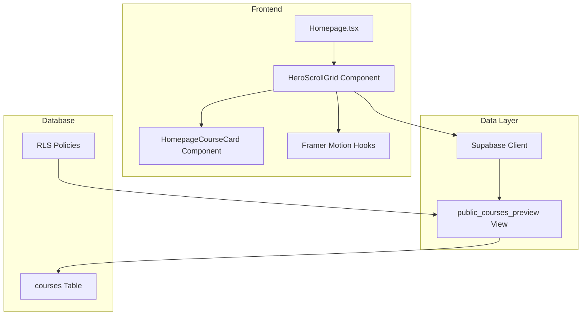

# Design Document: Hero-to-Grid Scroll Animation

## Overview

This feature adds an engaging scroll-linked animation to the Homepage that showcases public courses from the marketplace. The animation displays a randomly selected "hero" course card that scales down and joins a grid of other courses as the user scrolls, creating a visually compelling introduction to the platform's course offerings.

The implementation uses Framer Motion for scroll-based animations, a new Supabase database view for public course access, and responsive CSS Grid for the final layout.

## Architecture



## Components and Interfaces

### 1. HeroScrollGrid Component

The main component that orchestrates the scroll animation and course grid display.

```typescript
// src/components/HeroScrollGrid.tsx

interface PublicCoursePreview {
  id: string;
  title: string;
  description: string | null;
  topic: string;
  level: CourseLevel;
  thumbnail_url: string | null;
}

interface HeroScrollGridProps {
  className?: string;
}

// Component responsibilities:
// - Fetch public courses from database
// - Select random featured course
// - Fill grid with repeated courses if needed
// - Manage scroll-based animation state
// - Render sticky container with hero card and grid
```

### 2. HomepageCourseCard Component

A simplified course card for the homepage grid (no enrollment actions).

```typescript
// src/components/HomepageCourseCard.tsx

interface HomepageCourseCardProps {
  course: PublicCoursePreview;
  onClick: () => void;
  className?: string;
}

// Component responsibilities:
// - Display course thumbnail, title, description
// - Handle click to navigate to auth
// - Show hover state for interactivity
```

### 3. Animation Hook

Custom hook to encapsulate scroll animation logic.

```typescript
// Inside HeroScrollGrid component

// Uses Framer Motion hooks:
// - useScroll({ target: containerRef, offset: ["start start", "end end"] })
// - useTransform(scrollYProgress, [0, 1], [startScale, endScale])
// - useTransform(scrollYProgress, [0, 1], [startY, endY])
// - useTransform(scrollYProgress, [0, 0.8, 1], [0, 0, 1]) for grid opacity
```

### 4. Public Courses API

Database view and fetch function for public course data.

```typescript
// src/lib/publicCourses.ts

export async function fetchPublicCoursePreviews(): Promise<PublicCoursePreview[]> {
  const { data, error } = await supabase
    .from('public_courses_preview')
    .select('id, title, description, topic, level, thumbnail_url')
    .order('published_at', { ascending: false });
    
  if (error) throw error;
  return data ?? [];
}
```

## Data Models

### PublicCoursePreview Type

```typescript
interface PublicCoursePreview {
  id: string;
  title: string;
  description: string | null;
  topic: string;
  level: CourseLevel;
  thumbnail_url: string | null;
}
```

### Database View: public_courses_preview

```sql
CREATE VIEW public_courses_preview AS
SELECT 
  id,
  title,
  description,
  topic,
  level,
  thumbnail_url,
  published_at
FROM courses
WHERE is_public = true
ORDER BY published_at DESC;
```

### Grid Configuration

```typescript
interface GridConfig {
  desktop: { columns: 3; rows: 3; total: 9 };
  mobile: { columns: 2; rows: 5; total: 10 };
}
```

## Correctness Properties

*A property is a characteristic or behavior that should hold true across all valid executions of a system-essentially, a formal statement about what the system should do. Properties serve as the bridge between human-readable specifications and machine-verifiable correctness guarantees.*

Based on the prework analysis, the following properties must hold:

### Property 1: Scale and Position Interpolation

*For any* scroll progress value between 0 and 1, the Hero Card's scale and position values SHALL be deterministically calculated as linear interpolations, where scale transitions from 1.0 to the grid item scale, and position transitions from center to the target grid slot.

**Validates: Requirements 1.2, 6.3**

### Property 2: API Response Shape

*For any* course returned by the public_courses_preview view, the response object SHALL contain exactly the fields: id, title, description, topic, level, and thumbnail_url.

**Validates: Requirements 2.2, 3.2**

### Property 3: Public Courses Filter

*For any* course returned by the public_courses_preview view, the course's is_public field in the source table SHALL be true.

**Validates: Requirements 3.1**

### Property 4: Courses Ordering

*For any* array of courses returned by the API, each course's published_at timestamp SHALL be greater than or equal to the next course's published_at timestamp (descending order).

**Validates: Requirements 3.4**

### Property 5: Featured Course Selection

*For any* featured course selected by the component, that course SHALL be a member of the fetched public courses array.

**Validates: Requirements 2.3**

### Property 6: Grid Fill Logic

*For any* input array of courses with length N where N < required grid size, the fillGridCourses function SHALL return an array of exactly the required length where every element is from the original input array.

**Validates: Requirements 2.4**

### Property 7: Grid Item Opacity Interpolation

*For any* scroll progress value between 0 and 1, the grid items' opacity SHALL be a deterministic function of scroll progress, transitioning from 0 (hidden) to 1 (visible) as scroll progress increases.

**Validates: Requirements 6.4**

## Error Handling

| Error Scenario | Handling Strategy |
|----------------|-------------------|
| Database fetch fails | Display error message, hide animation section |
| No public courses exist | Hide animation section entirely |
| Image fails to load | Show gradient placeholder with icon |
| Framer Motion not available | Graceful degradation to static grid |

### Error States

```typescript
interface AnimationSectionState {
  status: 'loading' | 'ready' | 'error' | 'empty';
  courses: PublicCoursePreview[];
  error?: string;
}
```

## Testing Strategy

### Unit Testing

Unit tests will verify:
- Component renders correctly with mock data
- Click handler navigates to auth page
- Toast notification displays on click
- Loading skeleton renders during fetch
- Error state renders when fetch fails
- Empty state hides section when no courses

Testing framework: Vitest (already configured in project)

### Property-Based Testing

Property-based tests will use **fast-check** library to verify the correctness properties defined above.

Each property test will:
- Generate random inputs within valid ranges
- Execute the function under test
- Assert the property holds for all generated inputs
- Run minimum 100 iterations per property

Property tests will be tagged with comments referencing the design document:
```typescript
// **Feature: hero-to-grid-scroll-animation, Property 6: Grid Fill Logic**
```

### Integration Testing

- Verify database view returns correct data shape
- Verify RLS allows unauthenticated access to view
- Verify animation plays smoothly in browser

## Implementation Notes

### Dependencies to Add

```json
{
  "framer-motion": "^11.x"
}
```

### Animation Constants

```typescript
const ANIMATION_CONFIG = {
  scrollSpacerHeight: '300vh',
  heroStartScale: 1,
  heroEndScale: 0.33, // 1/3 for 3x3 grid
  heroStartY: 0,
  heroEndY: 0, // Calculated based on grid position
  gridOpacityStart: 0,
  gridOpacityEnd: 1,
  opacityTransitionStart: 0.3, // Start fading in grid at 30% scroll
};
```

### Responsive Breakpoints

```typescript
const BREAKPOINTS = {
  desktop: 1024, // px - matches Tailwind's lg breakpoint
};
```

### Z-Index Strategy

```typescript
const Z_INDEX = {
  grid: 1,
  heroCard: 10, // Hero floats above grid during animation
};
```
