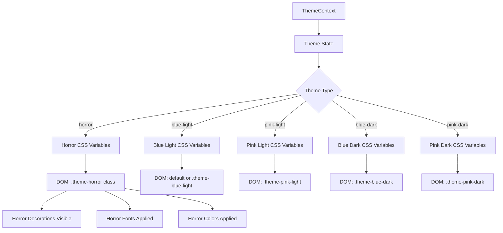
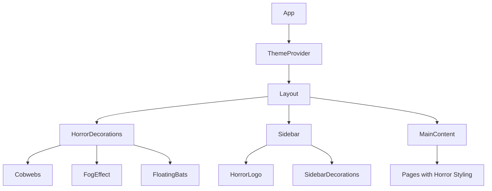

# Horror Theme Design Document

## Overview

This document outlines the technical design for implementing a Horror theme in the Lowkeygenius application for the Kiroween hackathon Costume Contest. The horror theme will transform the application into a spooky, Halloween-inspired experience while maintaining full functionality and seamless integration with the existing theme system.

The implementation follows the established theme architecture using CSS custom properties, React context, and conditional styling. Users can switch between the horror theme and normal themes at any time, with all horror-specific visual elements appearing or disappearing based on the active theme.

## Architecture

### Theme System Integration



### Component Hierarchy for Horror Elements



## Components and Interfaces

### New Components

#### HorrorDecorations
A wrapper component that renders horror-specific decorative elements when the horror theme is active.

```typescript
interface HorrorDecorationsProps {
  children?: React.ReactNode;
}

// Renders cobwebs, fog, floating bats only when horror theme is active
export function HorrorDecorations({ children }: HorrorDecorationsProps): JSX.Element;
```

#### Cobweb
SVG-based cobweb decoration for corners.

```typescript
interface CobwebProps {
  position: 'top-left' | 'top-right' | 'bottom-left' | 'bottom-right';
  size?: 'sm' | 'md' | 'lg';
  opacity?: number;
}

export function Cobweb({ position, size, opacity }: CobwebProps): JSX.Element;
```

#### FogEffect
CSS-based animated fog overlay.

```typescript
interface FogEffectProps {
  intensity?: 'light' | 'medium' | 'heavy';
}

export function FogEffect({ intensity }: FogEffectProps): JSX.Element;
```

#### FloatingBats
Animated bat silhouettes that float across the screen.

```typescript
interface FloatingBatsProps {
  count?: number;
}

export function FloatingBats({ count }: FloatingBatsProps): JSX.Element;
```

#### HorrorLogo
Horror-styled variant of the application logo.

```typescript
interface HorrorLogoProps {
  size?: 'sm' | 'md' | 'lg';
}

export function HorrorLogo({ size }: HorrorLogoProps): JSX.Element;
```

#### HorrorLoadingAnimation
Horror-themed loading spinner with skull or dripping effect.

```typescript
interface HorrorLoadingAnimationProps {
  size?: 'sm' | 'md' | 'lg';
  text?: string;
}

export function HorrorLoadingAnimation({ size, text }: HorrorLoadingAnimationProps): JSX.Element;
```

### Modified Components

#### ThemeContext Updates

```typescript
// Updated Theme type to include horror
export type Theme = 'pink-light' | 'blue-light' | 'pink-dark' | 'blue-dark' | 'horror';

// Updated validation function
function isValidTheme(theme: string): boolean {
  return ['pink-light', 'blue-light', 'pink-dark', 'blue-dark', 'horror'].includes(theme);
}

// Updated DOM application function
function applyThemeToDOM(theme: Theme) {
  const root = document.documentElement;
  root.classList.remove(
    'theme-pink-light', 
    'theme-blue-light', 
    'theme-pink-dark', 
    'theme-blue-dark',
    'theme-horror'
  );
  
  if (theme !== 'blue-light') {
    root.classList.add(`theme-${theme}`);
  }
  
  // Horror theme is always dark
  if (theme.includes('dark') || theme === 'horror') {
    root.classList.add('dark');
  } else {
    root.classList.remove('dark');
  }
}
```

#### ThemeSelector Updates

```typescript
const themeOptions: ThemeOption[] = [
  { value: 'blue-light', label: 'Blue Light' },
  { value: 'pink-light', label: 'Pink Light' },
  { value: 'blue-dark', label: 'Blue Dark' },
  { value: 'pink-dark', label: 'Pink Dark' },
  { value: 'horror', label: '🎃 Horror' }, // New option with spooky emoji
];
```

#### Layout Updates

```typescript
// Layout component will conditionally render HorrorDecorations
export function Layout({ children }: LayoutProps) {
  const { theme } = useTheme();
  const isHorror = theme === 'horror';
  
  return (
    <div className="layout">
      {isHorror && <HorrorDecorations />}
      <Sidebar />
      <main>{children}</main>
    </div>
  );
}
```

### Custom Hook

#### useHorrorTheme

```typescript
interface UseHorrorThemeReturn {
  isHorror: boolean;
  horrorClass: string;
}

export function useHorrorTheme(): UseHorrorThemeReturn {
  const { theme } = useTheme();
  return {
    isHorror: theme === 'horror',
    horrorClass: theme === 'horror' ? 'horror-active' : '',
  };
}
```

## Data Models

### Theme Configuration

```typescript
interface ThemeConfig {
  value: Theme;
  label: string;
  isDark: boolean;
  icon?: string;
}

const THEME_CONFIGS: Record<Theme, ThemeConfig> = {
  'blue-light': { value: 'blue-light', label: 'Blue Light', isDark: false },
  'pink-light': { value: 'pink-light', label: 'Pink Light', isDark: false },
  'blue-dark': { value: 'blue-dark', label: 'Blue Dark', isDark: true },
  'pink-dark': { value: 'pink-dark', label: 'Pink Dark', isDark: true },
  'horror': { value: 'horror', label: 'Horror', isDark: true, icon: '🎃' },
};
```

### Horror Color Palette

```typescript
interface HorrorColorPalette {
  primary: {
    DEFAULT: string;      // #DC143C (Crimson)
    soft: string;         // #FF6B6B
    light: string;        // #FF8A8A
    dark: string;         // #8B0000 (Dark Red)
    darker: string;       // #4A0000
  };
  secondary: {
    DEFAULT: string;      // #8B008B (Dark Magenta)
    light: string;        // #BA55D3
    dark: string;         // #4B0082
  };
  accent: {
    toxic: string;        // #39FF14 (Toxic Green)
    pumpkin: string;      // #FF6600
    ghost: string;        // #E8E8E8
    blood: string;        // #8B0000
  };
  neutral: {
    text: string;         // #E8E8E8
    textMuted: string;    // #B0B0B0
    bg: string;           // #0D0D0D
    surface: string;      // #1A1A1A
    surfaceDark: string;  // #2D2D2D
    border: string;       // #3D0000
  };
}
```

## Correctness Properties

*A property is a characteristic or behavior that should hold true across all valid executions of a system-essentially, a formal statement about what the system should do. Properties serve as the bridge between human-readable specifications and machine-verifiable correctness guarantees.*

Based on the prework analysis, the following correctness properties have been identified:

### Property 1: Theme Application Correctness
*For any* theme selection including horror, when the theme is applied, the document root element SHALL have exactly one theme class corresponding to the selected theme (or no theme class for blue-light default).

**Validates: Requirements 1.2**

### Property 2: Theme Switching Cleanup
*For any* sequence of theme switches ending in a non-horror theme, the document SHALL have no horror-specific CSS classes, no horror decorative elements visible, and the original logo/favicon restored.

**Validates: Requirements 1.3, 7.3**

### Property 3: Theme Persistence Round-Trip
*For any* theme including horror, setting the theme and then reading from localStorage SHALL return the same theme value that was set.

**Validates: Requirements 1.4**

### Property 4: Text Contrast Accessibility
*For any* text color and background color combination in the horror theme, the contrast ratio SHALL be at least 4.5:1 for body text to meet WCAG AA standards.

**Validates: Requirements 3.3**

### Property 5: Non-Horror Theme Cleanliness
*For any* theme that is not horror, the application SHALL render zero horror-specific decorative elements (cobwebs, bats, fog, blood drips, horror logo).

**Validates: Requirements 4.5**

## Error Handling

### Theme Loading Errors

1. **Invalid Theme Value**: If an invalid theme value is loaded from storage, fall back to 'blue-light' default
2. **Font Loading Failure**: If horror fonts fail to load, fall back to system fonts while maintaining horror colors
3. **SVG/Asset Loading Failure**: If decorative assets fail to load, hide the decoration gracefully without breaking layout

### Graceful Degradation

```typescript
// Example error boundary for horror decorations
function HorrorDecorationErrorBoundary({ children }: { children: React.ReactNode }) {
  return (
    <ErrorBoundary fallback={null}>
      {children}
    </ErrorBoundary>
  );
}
```

### Accessibility Error Prevention

```typescript
// Respect reduced motion preference
const prefersReducedMotion = window.matchMedia('(prefers-reduced-motion: reduce)').matches;

// Disable animations if user prefers reduced motion
if (prefersReducedMotion) {
  // Skip glitch, flicker, and floating animations
}
```

## Testing Strategy

### Property-Based Testing Library

The implementation will use **fast-check** for property-based testing in TypeScript/JavaScript.

### Unit Tests

Unit tests will cover:
- Theme context state management
- Theme selector rendering with horror option
- Horror decoration conditional rendering
- CSS class application logic
- localStorage persistence

### Property-Based Tests

Each correctness property will be implemented as a property-based test:

1. **Property 1 Test**: Generate random theme selections, verify exactly one theme class exists
2. **Property 2 Test**: Generate random theme switch sequences ending in non-horror, verify cleanup
3. **Property 3 Test**: Generate random themes, verify localStorage round-trip
4. **Property 4 Test**: Test all color combinations for contrast ratio compliance
5. **Property 5 Test**: Generate random non-horror themes, verify zero horror elements

### Test Annotations

All property-based tests will be annotated with:
```typescript
// **Feature: horror-theme, Property {number}: {property_text}**
// **Validates: Requirements X.Y**
```

### Visual Regression Testing (Manual)

- Screenshot comparison of all pages with horror theme active
- Verify decorative elements render correctly across viewport sizes
- Confirm animations work as expected (manual verification)
