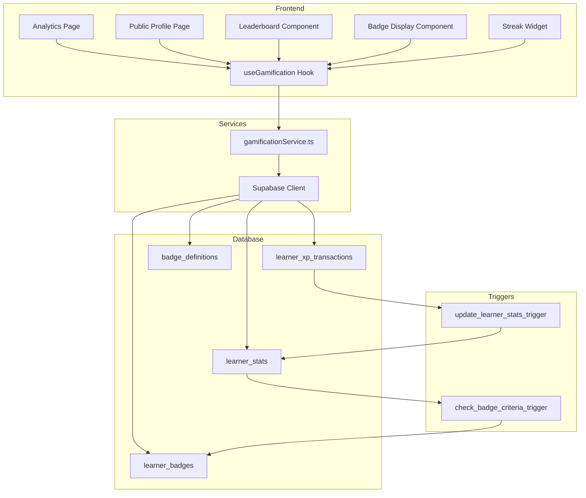

# Design Document: Learner Gamification System

## Overview

This design document outlines the architecture and implementation details for adding a comprehensive gamification system to Lowkeygenius. The system introduces experience points (XP), learning streaks, achievement badges, personal analytics dashboards, public learner profiles, and course leaderboards. The design leverages the existing Supabase infrastructure and follows established patterns in the codebase.

## Architecture

The gamification system follows a layered architecture:



### Data Flow

1. User completes a learning activity (lesson, quiz, flashcard session)
2. Frontend calls `gamificationService.awardXP()` with activity details
3. Service inserts XP transaction into `learner_xp_transactions`
4. Database trigger updates `learner_stats` (total XP, streak, last activity date)
5. Database trigger checks badge criteria and awards new badges to `learner_badges`
6. Frontend receives updated stats and displays notifications for new badges

## Components and Interfaces

### Frontend Components

#### AnalyticsPage (`src/pages/Analytics.tsx`)
Main analytics dashboard displaying:
- XP summary card with total XP and weekly XP
- Streak card with current and longest streak
- Activity heatmap (last 12 weeks)
- Course progress breakdown
- Recent XP transactions list
- Badge collection grid

#### PublicProfile (`src/pages/PublicProfile.tsx`)
Public-facing learner profile showing:
- Display name and avatar
- Total XP and current streak
- Earned badges
- Privacy-respecting data display

#### LeaderboardPanel (`src/components/LeaderboardPanel.tsx`)
Course-specific leaderboard showing:
- Top 10 learners by course XP
- Current user's rank if outside top 10
- Avatar, name, and XP for each entry

#### BadgeDisplay (`src/components/BadgeDisplay.tsx`)
Reusable badge grid component:
- Shows earned badges in full color
- Shows unearned badges as grayed silhouettes
- Supports tooltip with badge description

#### StreakWidget (`src/components/StreakWidget.tsx`)
Compact streak display for sidebar/header:
- Fire icon with current streak count
- Tooltip showing longest streak

#### XPNotification (`src/components/XPNotification.tsx`)
Toast notification for XP awards:
- Shows XP amount and activity type
- Animated entrance/exit

### Service Layer

#### gamificationService (`src/lib/gamificationService.ts`)

```typescript
interface XPTransaction {
  id: string;
  userId: string;
  courseId: string;
  activityType: 'lesson_complete' | 'quiz_complete' | 'flashcard_session';
  xpAmount: number;
  metadata: Record<string, unknown>;
  createdAt: string;
}

interface LearnerStats {
  userId: string;
  totalXp: number;
  currentStreak: number;
  longestStreak: number;
  lastActivityDate: string;
  lessonsCompleted: number;
  quizzesCompleted: number;
  flashcardSessionsCompleted: number;
}

interface Badge {
  id: string;
  code: string;
  name: string;
  description: string;
  iconUrl: string;
  category: 'streak' | 'xp' | 'course' | 'quiz' | 'special';
  criteria: BadgeCriteria;
}

interface LearnerBadge {
  id: string;
  userId: string;
  badgeId: string;
  earnedAt: string;
  badge: Badge;
}

// Service functions
awardXP(userId: string, courseId: string, activityType: string, metadata?: Record<string, unknown>): Promise<XPTransaction>
getLearnerStats(userId: string): Promise<LearnerStats>
getLearnerBadges(userId: string): Promise<LearnerBadge[]>
getCourseLeaderboard(courseId: string, limit?: number): Promise<LeaderboardEntry[]>
getPublicProfile(userId: string): Promise<PublicProfileData | null>
getXPTransactions(userId: string, limit?: number): Promise<XPTransaction[]>
getCourseXPBreakdown(userId: string): Promise<CourseXPSummary[]>
```

### Custom Hooks

#### useGamification (`src/hooks/useGamification.ts`)
Central hook for gamification data:
- Fetches and caches learner stats
- Provides XP award function with optimistic updates
- Manages badge notification state
- Handles real-time updates via Supabase subscriptions

#### useLeaderboard (`src/hooks/useLeaderboard.ts`)
Hook for course leaderboard data:
- Fetches leaderboard for specific course
- Handles pagination if needed
- Provides current user's rank

## Data Models

### Database Tables

#### `learner_xp_transactions`
Records every XP-earning event for audit and analytics.

| Column | Type | Description |
|--------|------|-------------|
| id | uuid | Primary key |
| user_id | uuid | FK to profiles |
| course_id | uuid | FK to courses |
| activity_type | text | 'lesson_complete', 'quiz_complete', 'flashcard_session' |
| xp_amount | integer | Points awarded |
| metadata | jsonb | Activity-specific data (quiz score, lesson id, etc.) |
| created_at | timestamptz | Transaction timestamp |

#### `learner_stats`
Cached aggregated stats per learner for fast reads.

| Column | Type | Description |
|--------|------|-------------|
| user_id | uuid | PK, FK to profiles |
| total_xp | integer | Lifetime XP |
| current_streak | integer | Current consecutive days |
| longest_streak | integer | Best streak achieved |
| last_activity_date | date | Last day with activity |
| lessons_completed | integer | Total lessons finished |
| quizzes_completed | integer | Total quizzes finished |
| flashcard_sessions_completed | integer | Total flashcard sessions |
| updated_at | timestamptz | Last update time |

#### `badge_definitions`
Static table defining all available badges.

| Column | Type | Description |
|--------|------|-------------|
| id | uuid | Primary key |
| code | text | Unique badge identifier |
| name | text | Display name |
| description | text | How to earn this badge |
| icon_url | text | Badge icon path |
| category | text | 'streak', 'xp', 'course', 'quiz', 'special' |
| criteria_json | jsonb | Criteria for earning |
| sort_order | integer | Display order |

#### `learner_badges`
Junction table for earned badges.

| Column | Type | Description |
|--------|------|-------------|
| id | uuid | Primary key |
| user_id | uuid | FK to profiles |
| badge_id | uuid | FK to badge_definitions |
| earned_at | timestamptz | When badge was earned |

#### `course_xp_summary`
Cached XP per user per course for leaderboards.

| Column | Type | Description |
|--------|------|-------------|
| id | uuid | Primary key |
| user_id | uuid | FK to profiles |
| course_id | uuid | FK to courses |
| total_xp | integer | XP earned in this course |
| updated_at | timestamptz | Last update time |

### Profile Extensions

Add to existing `profiles` table:
- `profile_visibility` (text, default 'public'): 'public' or 'private'
- `display_name` (text): Public display name (defaults to full_name)


## Correctness Properties

*A property is a characteristic or behavior that should hold true across all valid executions of a system-essentially, a formal statement about what the system should do. Properties serve as the bridge between human-readable specifications and machine-verifiable correctness guarantees.*

Based on the prework analysis, the following properties have been identified. Redundant properties have been consolidated where one property can validate multiple related criteria.

### Property 1: XP Award Amounts by Activity Type

*For any* learning activity completion, the XP awarded SHALL match the defined amounts: 10 XP for lesson completion, 25 XP for quiz completion with score >= 80%, 10 XP for quiz completion with score < 80%, and 5 XP for flashcard session completion.

**Validates: Requirements 1.1, 1.2, 1.3, 1.4**

### Property 2: XP Transaction Integrity

*For any* XP award event, a corresponding transaction record SHALL exist containing user_id, course_id, activity_type, xp_amount, and created_at timestamp, and the learner's cached total_xp SHALL equal the sum of all their transaction xp_amounts.

**Validates: Requirements 1.5, 8.1**

### Property 3: Streak Increment on First Daily Activity

*For any* learner with no activity recorded for the current calendar day, completing a learning activity SHALL increment their current_streak by exactly 1.

**Validates: Requirements 2.2**

### Property 4: Streak Reset After Gap

*For any* learner whose last_activity_date is more than 1 calendar day before the current date, completing a learning activity SHALL set their current_streak to 1.

**Validates: Requirements 2.3**

### Property 5: Longest Streak Invariant

*For any* learner_stats record, the longest_streak value SHALL always be greater than or equal to the current_streak value.

**Validates: Requirements 2.4**

### Property 6: Badge Award with Timestamp

*For any* badge criteria that becomes satisfied, a learner_badges record SHALL be created with the badge_id, user_id, and earned_at timestamp within the same transaction.

**Validates: Requirements 3.1**

### Property 7: Badge Display Chronological Order

*For any* collection of earned badges for a learner, the badges SHALL be ordered by earned_at timestamp in ascending order when retrieved for display.

**Validates: Requirements 3.5**

### Property 8: Course Completion Percentage Calculation

*For any* course and learner, the completion percentage SHALL equal (completed_lessons / total_lessons) * 100, where completed_lessons is the count of lessons with completed=true in user_progress.

**Validates: Requirements 4.3**

### Property 9: XP Transaction History Contains Required Fields

*For any* XP transaction returned by the API, the record SHALL contain activity_type and created_at fields with non-null values.

**Validates: Requirements 4.4**

### Property 10: Public Profile Data Completeness

*For any* public profile request for a user with profile_visibility='public', the response SHALL contain display_name, avatar_url, total_xp, current_streak, and earned badges.

**Validates: Requirements 5.1**

### Property 11: Public Profile Privacy Protection

*For any* public profile response, the data SHALL NOT contain email, subscription_status, subscription_ends_at, plan_type, or detailed course progress data.

**Validates: Requirements 5.2**

### Property 12: Private Profile Access Restriction

*For any* profile request for a user with profile_visibility='private', the response SHALL return null or an appropriate error indicating the profile is not publicly visible.

**Validates: Requirements 5.3**

### Property 13: Default Profile Visibility

*For any* newly created profile, the profile_visibility field SHALL default to 'public'.

**Validates: Requirements 5.4**

### Property 14: Leaderboard Size and Ordering

*For any* course leaderboard request, the response SHALL contain at most 10 entries, and entries SHALL be ordered by course XP in descending order.

**Validates: Requirements 6.1**

### Property 15: Leaderboard Entry Data Completeness

*For any* leaderboard entry, the record SHALL contain rank (integer), display_name, avatar_url, and course_xp fields.

**Validates: Requirements 6.2**

### Property 16: User Rank Outside Top 10

*For any* leaderboard request where the requesting user is not in the top 10, the response SHALL include the user's own rank and XP as a separate field.

**Validates: Requirements 6.3**

### Property 17: Leaderboard Privacy Filtering

*For any* leaderboard, all entries SHALL correspond to users with profile_visibility='public'. No private profiles SHALL appear in leaderboard results.

**Validates: Requirements 6.4**

### Property 18: Course XP Breakdown Data

*For any* course XP breakdown request, each course entry SHALL contain both total_xp (all-time) and weekly_xp (current week) values.

**Validates: Requirements 7.2**

### Property 19: Last Activity Date Update

*For any* learning activity completion, the learner's last_activity_date SHALL be updated to the current date.

**Validates: Requirements 8.2**

## Error Handling

### XP Award Failures

- If XP transaction insert fails, the entire operation rolls back
- Retry logic with exponential backoff for transient database errors
- Log failed XP awards for manual review

### Streak Calculation Edge Cases

- Handle timezone differences by using UTC dates consistently
- Handle first-ever activity (no previous last_activity_date) by initializing streak to 1
- Handle same-day multiple activities by only incrementing streak once per day

### Badge Criteria Evaluation

- Badge criteria evaluation runs in a database trigger to ensure atomicity
- If badge award fails, log error but don't fail the parent XP transaction
- Duplicate badge awards are prevented by unique constraint on (user_id, badge_id)

### Leaderboard Edge Cases

- Empty leaderboards return empty array with appropriate message
- Users with no course XP don't appear on leaderboard
- Handle deleted users gracefully (exclude from leaderboard)

### Public Profile Access

- Return 404-style response for non-existent users
- Return privacy message for private profiles
- Handle missing optional fields (avatar_url) gracefully

## Testing Strategy

### Property-Based Testing Library

The implementation will use **fast-check** for property-based testing in TypeScript. This library provides:
- Arbitrary generators for complex data types
- Shrinking for minimal failing examples
- Integration with Jest/Vitest test runners

### Property-Based Tests

Each correctness property will be implemented as a property-based test with a minimum of 100 iterations. Tests will be annotated with the format: `**Feature: learner-gamification, Property {number}: {property_text}**`

Key property tests:
1. XP award amounts match activity types (generate random activities, verify XP)
2. Transaction integrity (generate XP awards, verify sum equals cached total)
3. Streak logic (generate activity sequences with gaps, verify streak calculations)
4. Longest streak invariant (generate any learner_stats, verify longest >= current)
5. Leaderboard ordering (generate random course XP data, verify descending order)
6. Privacy filtering (generate mixed public/private profiles, verify leaderboard exclusion)

### Unit Tests

Unit tests will cover:
- Individual service functions with mocked Supabase client
- Component rendering with various data states
- Edge cases like empty data, single entries, boundary values
- Error handling paths

### Integration Tests

Integration tests will verify:
- End-to-end XP award flow from activity completion to stats update
- Badge award triggers firing correctly
- Leaderboard queries returning correct data
- Profile visibility settings affecting data access

### Test Data Generators

Custom generators for property tests:
- `arbitraryUserId`: Valid UUID generator
- `arbitraryCourseId`: Valid UUID generator
- `arbitraryActivityType`: One of 'lesson_complete', 'quiz_complete', 'flashcard_session'
- `arbitraryQuizScore`: Integer 0-100
- `arbitraryLearnerStats`: Complete learner stats with valid invariants
- `arbitraryDateSequence`: Sequence of dates for streak testing
