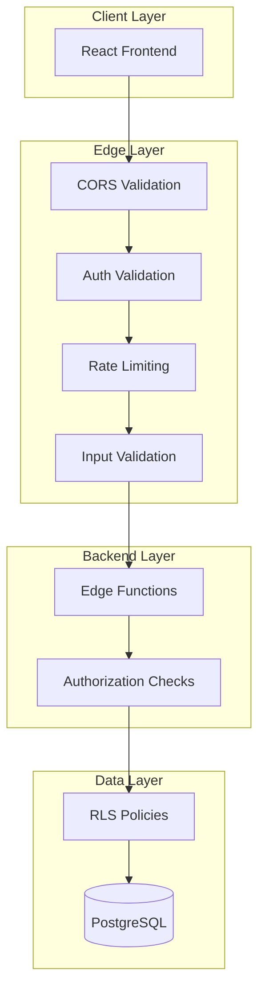

# Security Audit Design Document

## Overview

This design document outlines the security hardening measures required for the Progent platform before public deployment and open-sourcing. The audit addresses authentication, authorization, input validation, CORS configuration, rate limiting, webhook security, and protection against common web vulnerabilities.

## Architecture

The security architecture follows a defense-in-depth approach with multiple layers:



## Components and Interfaces

### 1. Authentication Middleware Pattern

All Edge Functions will follow a consistent authentication pattern:

```typescript
interface AuthResult {
  user: User | null;
  error: string | null;
}

async function validateAuth(req: Request, supabase: SupabaseClient): Promise<AuthResult> {
  const authHeader = req.headers.get('Authorization');
  if (!authHeader) {
    return { user: null, error: 'No authorization header' };
  }
  
  const token = authHeader.replace('Bearer ', '');
  const { data: { user }, error } = await supabase.auth.getUser(token);
  
  if (error || !user) {
    return { user: null, error: 'Invalid user token' };
  }
  
  return { user, error: null };
}
```

### 2. CORS Configuration

Production CORS configuration will use environment-based allowed origins:

```typescript
const getAllowedOrigins = (): string[] => {
  const origins = Deno.env.get('ALLOWED_ORIGINS');
  if (origins) {
    return origins.split(',').map(o => o.trim());
  }
  // Fallback for development
  return ['http://localhost:5173', 'http://localhost:3000'];
};

const getCorsHeaders = (origin: string | null): Record<string, string> => {
  const allowedOrigins = getAllowedOrigins();
  const allowedOrigin = origin && allowedOrigins.includes(origin) ? origin : allowedOrigins[0];
  
  return {
    'Access-Control-Allow-Origin': allowedOrigin,
    'Access-Control-Allow-Methods': 'POST, OPTIONS',
    'Access-Control-Allow-Headers': 'Content-Type, Authorization, X-Client-Info, Apikey',
    'Access-Control-Max-Age': '86400',
  };
};
```

### 3. Input Validation Utilities

Centralized input validation with length limits and type checking:

```typescript
interface ValidationResult {
  valid: boolean;
  error?: string;
}

const MAX_STRING_LENGTH = 10000;
const MAX_TOPIC_LENGTH = 200;
const MAX_CONTENT_LENGTH = 100000;

function validateStringInput(
  value: unknown, 
  fieldName: string, 
  maxLength: number = MAX_STRING_LENGTH
): ValidationResult {
  if (typeof value !== 'string') {
    return { valid: false, error: `${fieldName} must be a string` };
  }
  if (value.length > maxLength) {
    return { valid: false, error: `${fieldName} exceeds maximum length of ${maxLength}` };
  }
  return { valid: true };
}

function sanitizeForPrompt(input: string): string {
  // Remove potential prompt injection patterns
  return input
    .replace(/\b(ignore|disregard|forget)\s+(previous|above|all)\s+(instructions?|prompts?|rules?)/gi, '')
    .replace(/\b(system|assistant|user)\s*:/gi, '')
    .trim();
}
```

### 4. Rate Limiting Service

Rate limiting using Supabase for state storage:

```typescript
interface RateLimitConfig {
  windowMs: number;
  maxRequests: number;
}

const RATE_LIMITS: Record<string, RateLimitConfig> = {
  'generate-outline': { windowMs: 60000, maxRequests: 5 },
  'generate-lesson': { windowMs: 60000, maxRequests: 10 },
  'generate-audio': { windowMs: 60000, maxRequests: 3 },
  'default': { windowMs: 60000, maxRequests: 30 },
};

async function checkRateLimit(
  supabase: SupabaseClient,
  userId: string,
  endpoint: string
): Promise<{ allowed: boolean; retryAfter?: number }> {
  const config = RATE_LIMITS[endpoint] || RATE_LIMITS['default'];
  const windowStart = new Date(Date.now() - config.windowMs).toISOString();
  
  // Count recent requests
  const { count } = await supabase
    .from('rate_limit_log')
    .select('*', { count: 'exact', head: true })
    .eq('user_id', userId)
    .eq('endpoint', endpoint)
    .gte('created_at', windowStart);
  
  if ((count || 0) >= config.maxRequests) {
    return { allowed: false, retryAfter: Math.ceil(config.windowMs / 1000) };
  }
  
  // Log this request
  await supabase.from('rate_limit_log').insert({
    user_id: userId,
    endpoint,
  });
  
  return { allowed: true };
}
```

### 5. Webhook Signature Validation

Strict webhook signature validation for Polar webhooks:

```typescript
async function validateWebhookSignature(
  body: string,
  signature: string | null,
  secret: string | null
): Promise<{ valid: boolean; error?: string }> {
  if (!secret) {
    console.warn('POLAR_WEBHOOK_SECRET not configured - webhook validation disabled');
    return { valid: true }; // Degraded mode
  }
  
  if (!signature) {
    return { valid: false, error: 'Missing webhook signature' };
  }
  
  try {
    // Use Polar SDK's validateEvent function
    validateEvent(body, signature, secret);
    return { valid: true };
  } catch (error) {
    return { valid: false, error: 'Invalid webhook signature' };
  }
}
```

## Data Models

### Rate Limit Log Table

New table for tracking rate limits:

```sql
CREATE TABLE IF NOT EXISTS rate_limit_log (
  id uuid PRIMARY KEY DEFAULT gen_random_uuid(),
  user_id uuid NOT NULL REFERENCES profiles(id) ON DELETE CASCADE,
  endpoint text NOT NULL,
  created_at timestamptz NOT NULL DEFAULT now()
);

-- Index for efficient queries
CREATE INDEX idx_rate_limit_log_user_endpoint_time 
  ON rate_limit_log(user_id, endpoint, created_at DESC);

-- Auto-cleanup old entries (older than 1 hour)
CREATE OR REPLACE FUNCTION cleanup_rate_limit_log()
RETURNS void AS $$
BEGIN
  DELETE FROM rate_limit_log WHERE created_at < now() - interval '1 hour';
END;
$$ LANGUAGE plpgsql SECURITY DEFINER SET search_path = public;
```

## Correctness Properties

*A property is a characteristic or behavior that should hold true across all valid executions of a system-essentially, a formal statement about what the system should do. Properties serve as the bridge between human-readable specifications and machine-verifiable correctness guarantees.*

### Property 1: Authentication Rejection
*For any* Edge Function endpoint and any request without a valid Authorization header or with an invalid JWT token, the endpoint SHALL return a 401 status code and not process the business logic.
**Validates: Requirements 1.1, 1.2**

### Property 2: Resource Ownership Enforcement
*For any* authenticated user attempting to access or modify a resource (course, lesson, note), the system SHALL deny access if the user is not the owner and not enrolled (for courses).
**Validates: Requirements 1.4, 8.1, 8.2**

### Property 3: Input Validation Enforcement
*For any* Edge Function receiving JSON input, if required fields are missing or of incorrect type, or if string fields exceed maximum length limits, the endpoint SHALL return a 400 status code with an error message.
**Validates: Requirements 3.1, 3.2**

### Property 4: Prompt Injection Sanitization
*For any* user-provided text that will be included in AI prompts, the sanitization function SHALL remove or neutralize prompt injection patterns while preserving legitimate content.
**Validates: Requirements 3.4**

### Property 5: XSS Payload Neutralization
*For any* user input containing HTML or JavaScript, the system SHALL escape or sanitize the content such that it cannot execute as code when rendered.
**Validates: Requirements 3.5**

### Property 6: RLS Data Isolation
*For any* authenticated user querying the database, the RLS policies SHALL ensure the user can only retrieve rows they own or are explicitly authorized to access (enrolled courses, public courses).
**Validates: Requirements 5.1, 5.2, 5.3**

### Property 7: Webhook Signature Validation
*For any* webhook request with an invalid or missing signature (when secret is configured), the webhook endpoint SHALL return a 401 status code and not process the event.
**Validates: Requirements 6.1, 6.2**

### Property 8: Webhook Idempotency
*For any* webhook event ID that has already been processed, subsequent requests with the same event ID SHALL be acknowledged without duplicate processing.
**Validates: Requirements 6.3**

### Property 9: PII Anonymization
*For any* user profile content containing email addresses, phone numbers, or names, the anonymization function SHALL replace all PII with placeholder tokens.
**Validates: Requirements 7.1**

### Property 10: Error Response Safety
*For any* error response from an Edge Function, the response body SHALL not contain stack traces, internal file paths, or sensitive configuration details.
**Validates: Requirements 7.2**

### Property 11: Quota Enforcement
*For any* user attempting to create content, the system SHALL verify the user has not exceeded their plan quota before allowing the operation.
**Validates: Requirements 8.3**

### Property 12: Premium Feature Gating
*For any* user attempting to access premium features (audio generation), the system SHALL verify the user has the required subscription tier or add-on.
**Validates: Requirements 8.5**

## Error Handling

### Error Response Format

All Edge Functions will use a consistent error response format:

```typescript
interface ErrorResponse {
  error: string;
  code?: string;
}

function createErrorResponse(
  message: string,
  status: number,
  corsHeaders: Record<string, string>,
  code?: string
): Response {
  // Never expose internal details
  const safeMessage = message.includes('stack') || message.includes('at /')
    ? 'An internal error occurred'
    : message;
    
  const body: ErrorResponse = { error: safeMessage };
  if (code) body.code = code;
  
  return new Response(JSON.stringify(body), {
    status,
    headers: { ...corsHeaders, 'Content-Type': 'application/json' },
  });
}
```

### Error Codes

| Code | Status | Description |
|------|--------|-------------|
| AUTH_MISSING | 401 | No authorization header |
| AUTH_INVALID | 401 | Invalid or expired token |
| FORBIDDEN | 403 | User lacks permission |
| NOT_FOUND | 404 | Resource not found |
| RATE_LIMITED | 429 | Too many requests |
| VALIDATION_ERROR | 400 | Invalid input |
| QUOTA_EXCEEDED | 403 | Plan quota exceeded |
| INTERNAL_ERROR | 500 | Server error |

## Testing Strategy

### Dual Testing Approach

The security audit will use both unit tests and property-based tests:

1. **Unit Tests**: Verify specific security scenarios and edge cases
2. **Property-Based Tests**: Verify security properties hold across all valid inputs

### Property-Based Testing Framework

We will use **fast-check** for TypeScript property-based testing.

### Test Categories

1. **Authentication Tests**
   - Property tests for token validation across all endpoints
   - Unit tests for specific token formats (expired, malformed, wrong signature)

2. **Authorization Tests**
   - Property tests for resource ownership verification
   - Unit tests for specific permission scenarios

3. **Input Validation Tests**
   - Property tests for input sanitization
   - Unit tests for specific XSS and injection payloads

4. **Rate Limiting Tests**
   - Unit tests for rate limit enforcement
   - Integration tests for rate limit state management

5. **Webhook Security Tests**
   - Property tests for signature validation
   - Unit tests for idempotency handling

### Test Configuration

Each property-based test will run a minimum of 100 iterations to ensure comprehensive coverage.

### Test Annotation Format

All property-based tests will be annotated with:
```typescript
// **Feature: security-audit, Property {number}: {property_text}**
```
